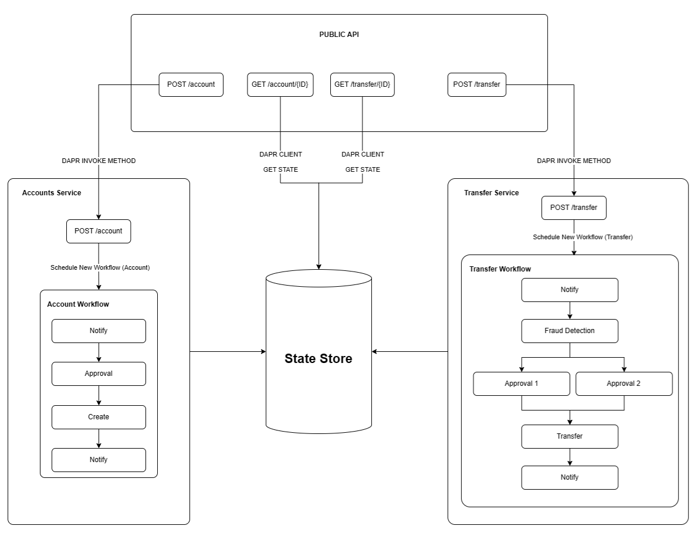

# Dapr Workflows for Java Sample
Initial playgroud to work with DAPR workflows in Java in k8s.

This sample depicts a simple money transfer application built on Java Spring Boot, leveraging Dapr Workflows for Java and  Dapr Service Invocation feature to manage account creation and money transfers in a k8s. The project focuses on simplicity, reliability, and extensibility, utilizing Dapr for state management and implementing some of [the workflow patterns](https://docs.dapr.io/developing-applications/building-blocks/workflow/workflow-patterns/) described in Dapr documentation.

It uses Dapr Workflows for Java for handling non-functional requirements such as retries and durability out of box.

## Features

- REST API Endpoints
    - Create Accounts
    - Get Account Information
    - Transfer Money between Accounts
    - Get Transfer Request Information

- State Store
    - Utilizes a Redis key-value map as the state store for efficient data management.

- DAPR Workflows
    - Leverages DAPR workflows to handle the creation of accounts and money transfer functionalities.
    - Implements workflow patterns such as Chain and Fanout for enhanced functionality.

- Java Version:
    - Developed using Java 17.

## Architecture Diagram




### Services

The project contains the following services:

- [Public API](/src/public-api-service) - Public API endpoint that receives new money transfer and account creation requests and calls the respective service via DAPR Service Method Invokation, that starts workflow and perform the operations. Public API can also access the state-store directly to check for status
- [Account Service](/src/account-service) - Service that handles the workflow for account creation.
- [Transfer Service](/src/transfer-service) - Transfer service that handles the workflow for a money transfer request. 

### How it works?

1. Public API endpoint receives new requests for account creation or money transfers. 
2. Public API invokes corresponding service depending on account creation or money transfer request using Service Invocation pattern and starts corresponding workflow in that service.
    2.1. Account Creation Workflow Starts
        2.1.1. Multiple tasks are performed via Workflow Activities called by the DAPR client such as Notification, Approval, Creation.
        2.1.2. A validation if the amount is valid for creating an account (greater than zero) is performed.
    2.2. Transfer workflow starts
        2.2.1. Multiple tasks are performed via Workflow Activities called by the DAPR client such as Notification, Fraud Detection, Transfer.
        2.2.2. It checks if `Sender` and `Receiver` exists, checks if `Sender` has enough funds and performs the actual transfer.
3. Public API can be used to check the account balances or the status of a transfer request.

## Getting Started

### Prerequisites
- Java 17
- [Springboot](https://spring.io/projects/spring-boot)
- [DAPR CLI](https://docs.dapr.io/getting-started/install-dapr-cli/)
- [Redis](https://redis.io/) 
- [Docker](https://www.docker.com/)
- [Kind](https://kind.sigs.k8s.io/) (for local deployment)
- [Azure CLI](https://learn.microsoft.com/en-us/cli/azure/) (for aks deployment)
- [Azure Developer (azd) CLI](https://learn.microsoft.com/en-us/azure/developer/azure-developer-cli/) (for aks deployment)


Alternatively, you can use DevContainers and Visual Studio Code for local development. Opening the project within a devContainer will automatically install all the required tools and extensions.


## Execution

We use Make commands to automate the build and deployment process. You can run the following command to see the available commands:

```bash
make help
```
The following commands are available:
```bash
help                 💬 This help message :)
start-local          🧹 Setup local Kind Cluster
start-aks            🧹 Setup Azure K8s Cluster
deploy-local         🚀 Deploy application resources locally
deploy-aks           🚀 Deploy application resources in Azure
run-local            💿 Run app locally
port-forward-local   ⏩ Forward the local port
dapr-dashboard       🔬 Open the Dapr Dashboard
test                 🧪 Run tests, used for both local and aks development
clean-local          🧹 Clean up local files
clean-aks            🧹 Clean up Azure AKS resources and deployments

```
### Resource provisioning
```bash
make start-local  ## for Local provisioning
make start-aks    ## for Azure provisioning
```

This sample is built to provide resource both on a local cluster or in an Azure Kubernetes Service (AKS). The environment you choose to run will define the command you use for provisioning and, in the next stages, the deployment and execution. 

Local Provisioning is handled via Kind (Kubernertes in Docker) tool, while Azure Deployment is handled via Azure Developer (azd) CLI.

Under the hoods, Local Provisioning executes the `scripts/start-local-env.sh` script and create a local cluster named `kind-azd-aks-workflow`. The script is also responsible for installing DAPR and deploying DAPR Dashboard, as well as installing Redis and deploying a State-store component. 

In the same fashion but through a different process, Azure Provisioning executes the `azd provision` command, which creates the resources in your azure subscription and reagion of interest (be sure to be logged in). A post-provision hook calls the `scripts/dapr-install-aks.sh` to install the necessary dependencies in the AKS Cluster.

### Services Deployment

```bash
make deploy-local  ## for Local provisioning
make deploy-aks    ## for Azure provisioning
```

The above commands run the same script, `scripts/deploy-services.sh`, with different switches (options are `--local` and `--azure`). You need to choose the same environment as you did for resource provisioning.

Each service has, in it's folder structure, its respective Dockerfile and a `service-deploy.sh` script, which contains the manifests for each deployment. The services' scripts are called when you call the deployment make command.

### Running the application

```bash
# if in local-mode, execute port-forwarding so the kind cluster can be accessible via localhost.
make port-forward-local

make test
```

The `make test` performs a automated full cycle of the application usage by getting the front-end IP for the public API in the kubernetes cluster (or fallback to localhost for the local deployment) and calling the endpoints to create 2 accounts and perform a money transfer.
Below is the output for the test.

```bash
🧪 Getting front end IP from cluster configuration

⚠  Could not get front end IP - Assigning local IP
Front end IP: localhost:8080

🧪 Creating accounts
{
  "owner": "A",
  "amount": 100
}
{
  "owner": "B",
  "amount": 100
}

🧪 Transfering money
TransferId: 31dbe

🧪 Showing results
{
  "message": "Transfer Completed.",
  "status": "COMPLETED",
  "transferId": "31dbe"
}

🧪 New account balances
{
  "owner": "A",
  "amount": 77
}
{
  "owner": "B",
  "amount": 123
}
```

### Access the DAPR Dashboard:

```bash
make dapr-dashboard
```

Use this to easily inspect the k8s pods, where you can see the logs both for the application and the dapr sidecar for each service.

## Usage

### REST API Endpoints
With the application running, you can access the public API endpoints to perform the following tasks:

- Create Account:
    - Endpoint: **POST /accounts**
    - Request Body: JSON with account details.
        ```json
        {
            "owner": "B",
            "amount": "100"
        }
        ```

- Get Account Information:
    - Endpoint: **GET /accounts/{accountId}**
    - Returns JSON with account details.

- Transfer Money:
    - Endpoint: **POST /transfers**
    - Request Body: JSON with transfer details (source, destination, amount).
        ```json
        {
            "sender": "A",
            "receiver": "B",
            "amount": "23"
        }
        ```

- Get Transfer Information:
    - Endpoint: **GET /transfers/{transferId}**
    - Returns JSON with transfer details.
